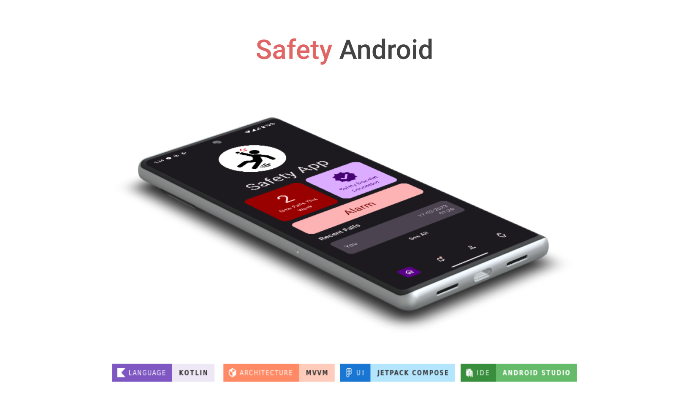
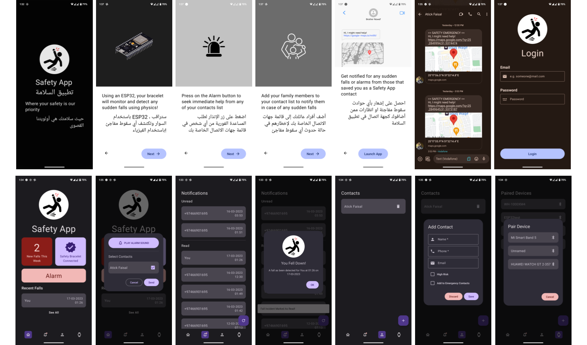

<h1 align="center">
Safety Android
</h1>

Where Your Safety is Our  Priority

    
    
    

 

  

 

<h3 align="center">
  SCREENSHOTS
</h3>

  

 
 
 

<a href="https://sites.google.com/view/mchowdhury" target="_blank">Qatar University Machine Learning Group</a>

